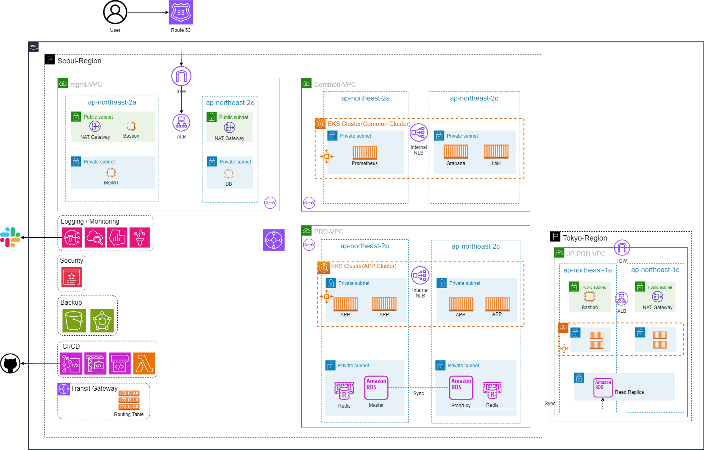
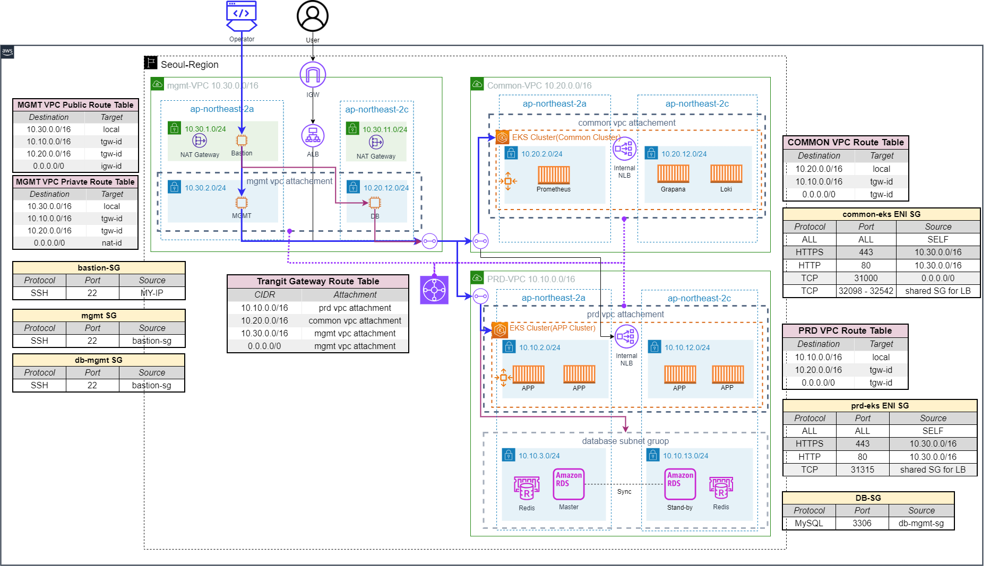

# BOB-final-project
## 2023 BTC 3기 AWS 3팀 (BOB) Final Project  

### Requirements
- **테라폼으로 인프라 구성**  
    - 세미 프로젝트 주제를 IaC환경으로 운영  
- **WEB/WAS 컨테이너 빌드 및 관리형 쿠버네티스 운영**  
    - EKS/ECR 에서 WEB/WAS 운영 및 RDS 연동  
- **CI/CD 구성**  
    - Git, Jenkins, AWS 관리형 서비스 등을 연동하여 구성  
- **기타 추가 확장 여부 선택**  
    - Route53, EFS 확장 등  
    - VPN, 모니터링 구성    
---  
### Infrastructure
  



### Presentation
[확장가능한 AWS 인프라 구축 및 MSA 운영 최적화](https://docs.google.com/presentation/d/19_dAj2AtoGh38HFiZyarWEPBwBLIznPVRqUMC2vqqH4/edit?usp=sharing)

### About BOB
```Bastion of Bespin```    
*Let’s Navigate for the Growth!*  

>BoB는 성장을 위한 상호 피드백을 겸허히 수용합니다.  
>BoB는 서로의 가치관을 존중하고 경청합니다.  
>BoB는 팀의 더 나은 방향을 위해 대립할지언정, 언제나 웃으며 귀가합니다.  

[BOB Main Notion 바로가기](https://dream-amal.notion.site/BTC-3-AWS-3-BoB-8bf7a10ff65145ecb27663a42857e956?pvs=4)  

**History**  
1. Midterm Project   
    - AWS 3tier architecture 구현  
    - [petclinic](https://github.com/spring-projects/spring-petclinic) 서비스 빌드 및 시연  
    - [BOB Midterm Project Notion 바로가기](https://dream-amal.notion.site/Midterm-Project-BoB-5f64d9c81e27417eadfb7fc2d4b26089?pvs=4)  
2. Semi Project  
    - AWS EKS로 [petclinic](https://github.com/spring-projects/spring-petclinic) 서비스 구현  
    - [BOB Semi Project Notion 바로가기](https://dream-amal.notion.site/Semi-Project-BoB-663ed488e6ab44e1a1162358fc2b50fa?pvs=4)  
3. **Final Project**   
    - Terraform IaC 구현  
    - CI/CD 구현  
    - [BOB Final Project Notion 바로가기](https://dream-amal.notion.site/Final-Project-BoB-698ed737ac6a46969942c76a47cc6176?pvs=4)

### About Member   
- 길은실 [개인 notion 바로가기](https://dream-amal.notion.site/dream-amal/BTC-3-_-a4a85518dc4341afa69267e74e95c480)  
- 김경민 [개인 notion 바로가기](https://power-liver-617.notion.site/BTC_3-_-f29b478556834e2aa6ca69cf8a514293)
- 노우정 [개인 notion 바로가기](https://skyhigh-ops.notion.site/BTC-3-7f62f1a7616d4cc795e6a57b5fdc2ebd)
- 이준호 [개인 notion 바로가기](https://open-owner-aca.notion.site/BTC_3-471a285ca1914144b53cc740a8c5a0d4)
